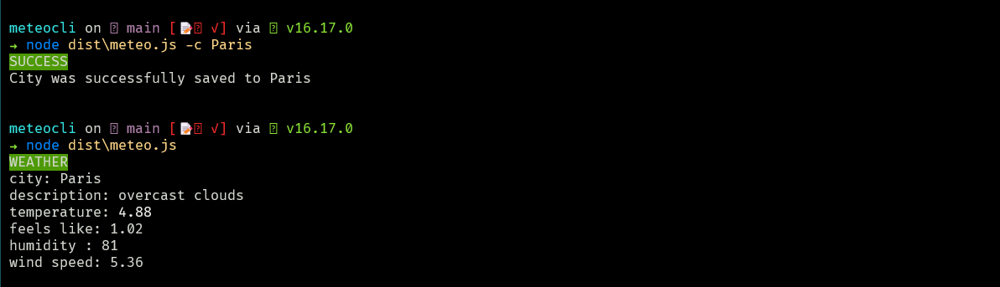

# Meteo CLI

Meteo CLI is a command-line interface (CLI) tool that allows users to quickly and easily check the current weather conditions for a given location. The tool is built using TypeScript and utilizes the API provided by [OpenWeatherMap API](api.openweathermap.org).



## Installation

To use Meteo CLI, you will need to have Node.js and npm (Node Package Manager) installed on your computer. Once you have these prerequisites, you can proceed with the following steps:

1. Clone the Meteo CLI repository to your local machine by running git clone https://github.com/n-drobyshevski/meteoCli
2. Navigate to the meteoCLI directory by running `cd meteoCli`
3. Install the required dependencies by running `npm install`
4. Compile the TypeScript code to JavaScript by running `npm run build`

## Usage

To check the weather for a given city, you can run the following command:

`node dist/meteo.js`

To set the name of the city you would like to check the weather for run
`node dist/meteo.js -c [city]`

Also you needto set your API key from [OpenWeatherMap API](api.openweathermap.org).
`node dist/meteo.js -t [apiKey]`

For example, to check the weather for London, you would run these following commands:

```cmd
node dist/meteo.js -t [apiKey]
node dist/meteo.js -c London
node dist/meteo.js
```

The tool will then output the current temperature, humidity, and weather conditions for the specified location.

## Additional Features

You can also specify the language by using the -l flag. The default language is English, but you can also use other languages by specifying -l [language code]

## Built With

- TypeScript
- OpenWeatherMap API (api.openweathermap.org)
